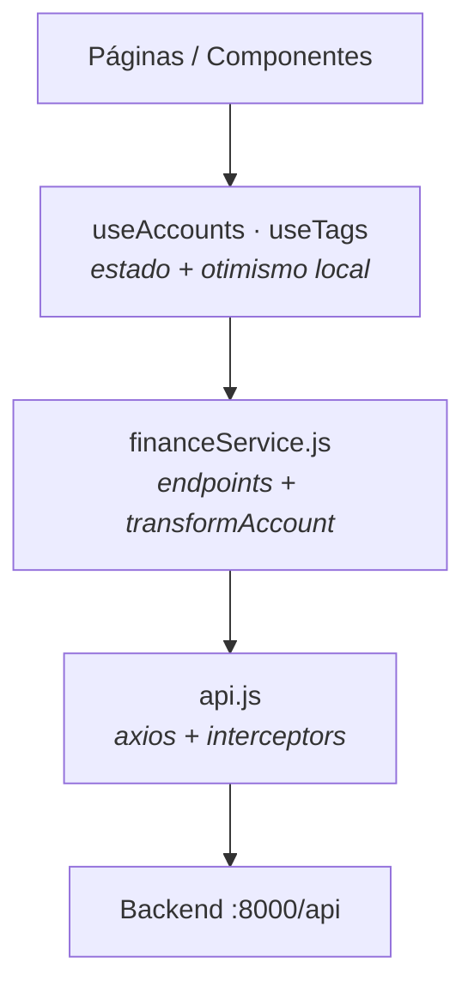

# Camada de Dados (frontend)

Quatro camadas, cada uma com uma responsabilidade:



> **Não há estado global.** Sem Redux, sem Context para dados. Cada página tem
> sua própria instância de `useAccounts` — o [[Tela-Dashboard|Dashboard]] tem
> quatro. Context é usado **só** para [[Toast]] e [[ConfirmDialog]].

---

## `api.js` — instância axios

`baseURL: http://localhost:8000/api`

### Interceptor de request
Injeta `Authorization: Bearer {localStorage.authToken}` em **todas** as
requisições, automaticamente. Nenhum service precisa passar token.

### Interceptor de response ⚠️ pouco conhecido
Em **401**: limpa `authToken` e redireciona para `/Login`
(com guarda para não redirecionar se já estiver lá).

> **Consequência prática:** token expirado não trava a UI — a primeira chamada
> derruba a sessão automaticamente. Se você implementar refresh token, é aqui
> que ele entra.

### Limitação
**A `baseURL` é hardcoded.** Não há `import.meta.env.VITE_API_URL`. Deploy fora
do localhost exige mudar código. Ver [[O-que-o-sistema-nao-faz]].

---

## `financeService.js`

Todos os métodos de CRUD, mais o normalizador.

```js
fetchAccounts(tipo, year, month)      // GET /financas/{endpoint}?year=&month=
createAccount(accountData)            // POST /financas/create
updateAccount(id, accountData)        // PUT /financas/update/{id}
deleteAccount(id)                     // DELETE /financas/delete/{id}
updatePaymentStatus(id, competencia, status)  // PUT /financas/payment-status/{id}
fetchSalary()                         // GET /financas/salary
importPreview(content)                // POST /financas/import/preview
importCommit(items)                   // POST /financas/import/commit
fetchTags()                           // GET /financas/tags
createTag({ nome, cor })              // POST /financas/tags
updateTag(id, { nome, cor })          // PUT /financas/tags/{id}
deleteTag(id)                         // DELETE /financas/tags/{id}
transformAccount(item)                // normaliza a resposta
```

### `transformAccount` é o único ponto de tradução

API (`snake_case` PT) → frontend (`camelCase`). Ver [[Lancamento]] para o mapa
completo.

> **Todo campo novo precisa passar por aqui.** Esquecer é o erro clássico: o
> dado chega no backend, é salvo, e **some no caminho de volta** — sem erro
> nenhum. Ver [[Guia-Novo-Campo-no-Lancamento]].

---

## `useAccounts(tipo, filterYear, filterMonth)`

```js
const { accounts, loading, error, fetchAccounts,
        addAccount, updateAccount, deleteAccount, togglePaymentStatus }
  = useAccounts(tipo, filterYear, filterMonth);
```

- Fetch automático no mount e quando `tipo`/filtros mudam
- **Todos os métodos retornam** `{ success: true, data? }` ou
  `{ success: false, error: string }` — nunca lançam. A UI decide o [[Toast]].
- `isMountedRef` evita `setState` após desmontar

### Três comportamentos que não são óbvios

**1. O tipo do modal vence o tipo da página.**
`addAccount` faz `{ tipo, ...accountData }` — se `accountData` trouxer `tipo`,
ele prevalece. É o que permite o [[QuickAddModal]] criar em qualquer bucket a
partir do Dashboard.

**2. A lista se auto-corrige por tipo.**
Se um lançamento criado/editado ficar com tipo ≠ o da página, ele **não entra**
na lista (ou **sai** dela). Editar uma Conta para Opcional a faz desaparecer da
tela de Contas — comportamento correto, mas surpreendente ao ver pela primeira vez.

**3. `togglePaymentStatus` atualiza `pagamentos` localmente.**
Não confia no formato da resposta (o backend pode devolver a conta inteira ou só
o registro). Monta a nova lista no cliente:
```js
"S" → Array.from(new Set([...current, competencia]))
"N" → current.filter(c => c !== competencia)
```
Ver [[Competencia-e-Pagamento]].

---

## `useTags()`

Busca as tags **uma vez** e expõe `addTag` / `editTag` / `removeTag`.
Consumido pelo [[TagPicker]].

---

## Padrão de erro

```js
err.response?.data?.error || "Mensagem padrão"
```

O backend devolve `{ error: "..." }`. Mantenha esse formato ao criar endpoints
novos, senão a UI cai sempre na mensagem genérica.

---

## Relacionadas
[[Lancamento]] · [[Endpoints]] · [[Autenticacao]] · [[ExpenseBox]] · [[Guia-Novo-Campo-no-Lancamento]]
