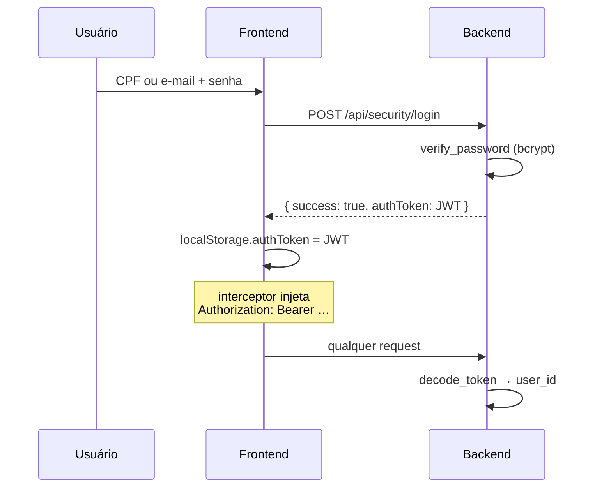

# Autenticação

JWT stateless. Sem sessão no servidor, sem refresh token, sem revogação.

---

## O fluxo



---

## Login aceita CPF **ou** e-mail

```python
select(User).where((User.cpf == data.username) | (User.email == data.username))
```

O campo se chama `username` e resolve os dois. É convenção do projeto.

---

## Token

| | |
|---|---|
| Algoritmo | **HS256** |
| Payload | `{ "sub": str(user.id), "exp": … }` |
| Expiração | **1 dia** (`JWT_EXPIRE_MINUTES = 60 * 24`) |
| Segredo | `JWT_SECRET` do `.env` |

> ⚠️ O **default** do `JWT_SECRET` é literalmente
> `"troque-este-segredo-em-producao"`. Sem `.env`, a aplicação sobe com um
> segredo público conhecido.

---

## Senha

`passlib` + **bcrypt**.

> 🔒 **Pin obrigatório: `bcrypt==3.2.2` enquanto `passlib` for `1.7.4`.**
> `bcrypt 4.x` quebra o login **silenciosamente** — já aconteceu neste projeto.
> É por isso que existe a skill `/verify-requirements`, que **deve** rodar antes
> de qualquer release. Ver o `CLAUDE.md` do backend.

`verify_password` captura `UnknownHashError` e devolve `False` — um hash
malformado (ex.: senha gravada em texto puro direto no banco) vira **401**, não
**500**.

---

## Proteção no frontend

**`PrivateRoute`** envolve todas as rotas exceto `/Login`. Ele checa apenas
**se existe** `localStorage.authToken`.

> **Não valida assinatura nem expiração.** Com token expirado a navegação
> passa normalmente; quem derruba a sessão é o **interceptor de resposta 401**
> do [[Camada-de-Dados|api.js]], que limpa o token e redireciona.
>
> Efeito visível: com token vencido, a tela abre e só então "pula" para o login
> quando a primeira chamada volta 401.

---

## Logout é client-side

```js
localStorage.removeItem('authToken')
```

Nada é comunicado ao backend. **Um JWT vazado continua válido até expirar** —
não há blacklist nem revogação. Ver [[Tela-Settings]].

---

## O que não existe

- **Refresh token** — expirou, precisa logar de novo
- **Revogação / logout de todas as sessões**
- **2FA**
- **Recuperação de senha** (nem endpoint, nem tela)
- **OAuth** — os botões Google/Apple/Microsoft são placeholder
- **Rate limit** de tentativas de login
- **Verificação de e-mail** no cadastro

Ver [[O-que-o-sistema-nao-faz]].

---

## Relacionadas
[[Tela-Login]] · [[Tela-Settings]] · [[Camada-de-Dados]] · [[Endpoints]] · [[Ambiente-de-Dev]]
