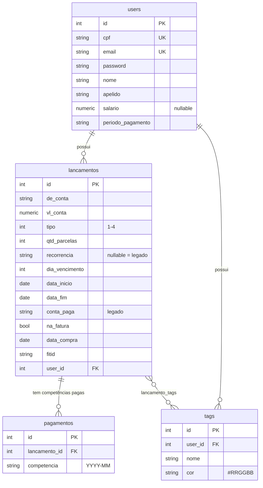

# Modelo de Dados

Cinco tabelas. SQLAlchemy 2.0 (`Mapped`/`mapped_column`) + PostgreSQL.

---

## `users`

Guarda **também** o [[Salario|salário]] (`salario`, `periodo_pagamento`) — não
há tabela separada de configuração.

`cpf` e `email` são **únicos e indexados**.

> ⚠️ `PUT /security/profile` **não checa e-mail duplicado** antes de gravar —
> confia na constraint. Trocar para um e-mail já existente estoura
> `IntegrityError` → 500, em vez de um 400 amigável. Ver [[Pendencias]].

---

## `lancamentos`

A tabela central. Uma linha por [[Lancamento|lançamento]], **não por parcela**.
Ver [[Lancamento]] para o dicionário completo de campos.

Índices: `tipo`, `user_id`, `fitid`.

`user_id` com `ondelete=CASCADE` — apagar usuário leva tudo junto.

---

## `pagamentos`

Status **por competência**. Ver [[Competencia-e-Pagamento]].

- `UniqueConstraint(lancamento_id, competencia)`
- **Ausência de linha = parcela pendente.** Não existe registro com
  `pago = false`.
- `cascade="all, delete-orphan"` no relacionamento

---

## `tags` + `lancamento_tags`

- `UniqueConstraint(user_id, nome)` — nome único **por usuário**
- `nome` ≤ 40 · `cor` = hex `#RRGGBB` (9 chars de folga)
- Associação N:N com `CASCADE` **nos dois lados**

Ver [[Tag]].

---

## Decisões estruturais a preservar

1. **Uma tabela para todos os tipos.** Metas, contas, investimentos e compras
   de cartão são todos `lancamentos`, discriminados por `tipo` e flags. É o que
   permite o [[Tela-Dashboard|Dashboard]] somar tudo com uma função só.

2. **Nada de agregado materializado.** Não há coluna de total, de acumulado ou
   de progresso. Tudo é derivado em tempo de leitura. Ver
   [[ADR-003-Metas-derivadas]].

3. **Campos legados permanecem.** `conta_paga` e a ausência de `recorrencia`
   continuam suportados. Não há migração de dados retroativa — a compatibilidade
   é feita em código.

---

## Relacionadas
[[Lancamento]] · [[Competencia-e-Pagamento]] · [[Tag]] · [[Salario]] · [[Migracoes]] · [[Endpoints]]
