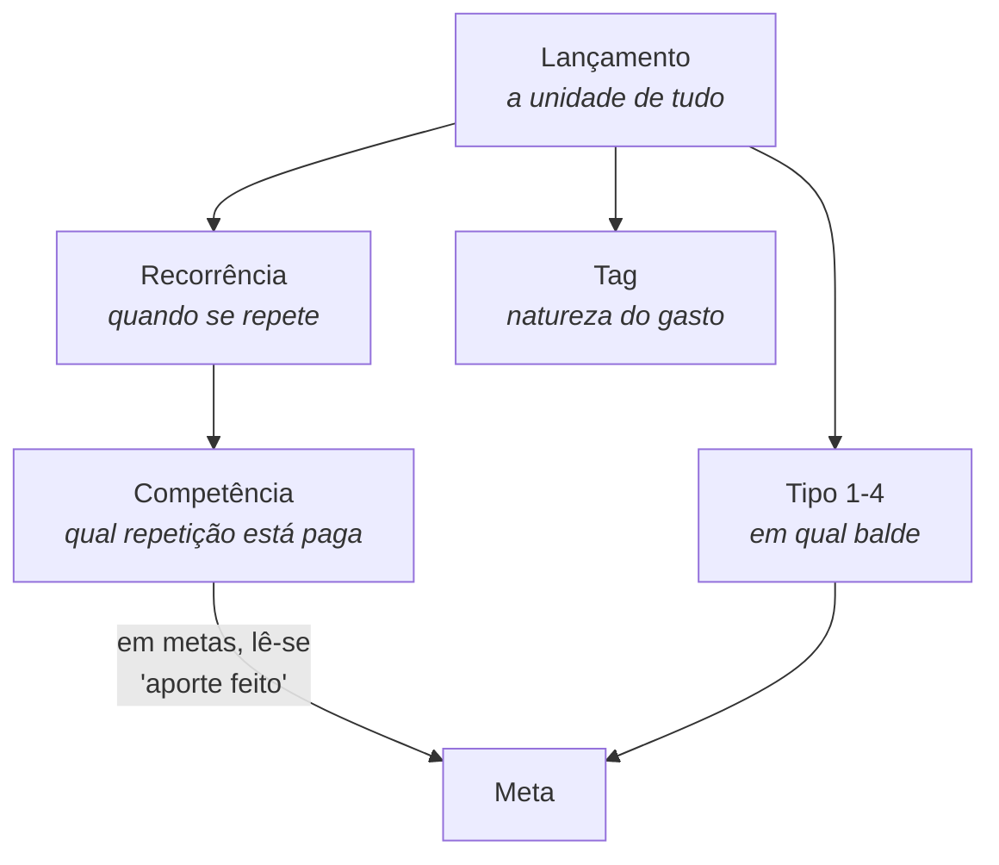
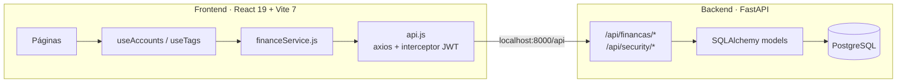

# 🗺️ Mapa do Sistema

Hub central do vault. Se você não sabe por onde começar, comece aqui.

---

## O que é o Financial Control

Um app **pessoal** de controle financeiro construído em torno de uma única
ideia: o salário se divide em quatro baldes — **60% Contas · 20% Investimentos
· 10% Opcionais · 10% Metas** — e o sistema existe para mostrar o quanto a
realidade está aderente a esse plano.

Tudo no sistema é um **[[Lancamento|lançamento]]** classificado por
[[Tipo|tipo]] (o balde) e opcionalmente rotulado por [[Tag|tags]] (a natureza
do gasto). Um lançamento pode se repetir ao longo do tempo
([[Recorrencia|recorrência]]), e cada repetição é quitada de forma independente
([[Competencia-e-Pagamento|competência]]).

> **Usuário único por conta.** Não é multiusuário colaborativo — não há
> compartilhamento, papéis ou família. Ver [[O-que-o-sistema-nao-faz]].

---

## Os quatro conceitos que sustentam tudo

Se você entender esses quatro, entende o sistema:

1. **[[Lancamento]]** — a unidade atômica. Tudo é lançamento, inclusive meta.
2. **[[Tipo]]** — o balde do orçamento (60/20/10/10). É o *plano*.
3. **[[Recorrencia]]** — como o lançamento se espalha no tempo.
4. **[[Competencia-e-Pagamento]]** — 1 lançamento recorrente vira N parcelas,
   e cada parcela é paga (ou não) por conta própria.

E o que atravessa todos eles:

- **[[Tag]]** — a *natureza* do gasto, transversal ao tipo. "Mercado" pode
  aparecer em Contas e em Opcionais.

---

## Navegação

### 01 · Domínio — a regra de negócio
| Nota | Responde |
|---|---|
| [[Glossario]] | O que cada palavra significa aqui dentro |
| [[Lancamento]] | O que é a unidade de dado do sistema |
| [[Tipo]] | Os 4 baldes e a divisão 60/20/10/10 |
| [[Recorrencia]] | Única, Mensal, Anual — e o legado |
| [[Competencia-e-Pagamento]] | Como uma parcela específica é quitada |
| [[Tag]] | Categorização transversal ao tipo |
| [[Meta]] | Aporte recorrente com progresso derivado |
| [[Salario]] | A base de cálculo de todo o dashboard |
| [[Fatura-de-Cartao]] | Duas datas, marcador 💳 e importação |

### 02 · Telas — o que o usuário consegue fazer
| Nota | Rota |
|---|---|
| [[Tela-Dashboard]] | `/` |
| [[Tela-Financas]] | `/Financas` (hub) |
| [[Tela-Despesas]] | `/Contas`, `/Investments`, `/Optional` |
| [[Tela-Metas]] | `/metas` |
| [[Tela-Importar-Extrato]] | `/importar` |
| [[Tela-Dados]] | `/Dados` |
| [[Tela-Settings]] | `/Settings` |
| [[Tela-Login]] | `/Login` |

### 03 · Componentes e dados do front
| Nota | É |
|---|---|
| [[ExpenseBox]] | O componente central — 3 telas são ele |
| [[QuickAddModal]] | Criação rápida a partir do Dashboard |
| [[TagPicker]] | Seleção/criação/exclusão de tags |
| [[Toast]] | Notificações globais |
| [[ConfirmDialog]] | Confirmação de ação destrutiva |
| [[DatePicker-e-Select]] | Substitutos dos controles nativos |
| [[Camada-de-Dados]] | `api.js`, `financeService.js`, `useAccounts`, `useTags` |

### 04 · Backend
| Nota | Cobre |
|---|---|
| [[Modelo-de-Dados]] | Tabelas e relações |
| [[Endpoints]] | Contratos da API |
| [[Autenticacao]] | JWT, login por CPF ou e-mail |
| [[Migracoes]] | O que cada migração trouxe e por quê |

### 05 · Decisões (ADRs)
As decisões com trade-off, para não serem refeitas por engano →
[[05-Decisoes/ADR-Index|Índice de ADRs]]

### 06 · Guias
| Nota | Para quando |
|---|---|
| [[Guia-Antes-de-Implementar]] | Checklist antes de mexer em qualquer coisa |
| [[Guia-Novo-Campo-no-Lancamento]] | Adicionar campo ponta a ponta |
| [[Convencoes]] | Estilo, nomenclatura, estrutura de arquivo |
| [[Ambiente-de-Dev]] | Subir front e back; armadilhas de CORS/porta |

### 07 · Limites
| Nota | |
|---|---|
| [[O-que-o-sistema-nao-faz]] | Limites deliberados e não-deliberados |
| [[Pendencias]] | Bugs conhecidos e dívida aceita |

---

## Arquitetura em uma tela

**Ponto de atenção estrutural:** o **filtro por período é feito no frontend**.
O backend devolve todos os lançamentos do tipo e o front decide o que aparece
em cada mês. Isso é decisão consciente — ver
[[ADR-005-Filtro-de-periodo-no-frontend]].

---

## Por onde começar, por tipo de tarefa

| Vou fazer… | Leia antes |
|---|---|
| Mexer em como algo se repete no tempo | [[Recorrencia]] → [[Competencia-e-Pagamento]] |
| Mexer em pagamento / "marcar como paga" | [[Competencia-e-Pagamento]] → [[ADR-002-Pagamento-por-competencia]] |
| Mexer em metas | [[Meta]] → [[ADR-003-Metas-derivadas]] |
| Mexer no Dashboard | [[Tela-Dashboard]] → [[Tipo]] → [[Salario]] |
| Mexer em cartão / importação | [[Fatura-de-Cartao]] → [[Tela-Importar-Extrato]] |
| Adicionar campo no lançamento | [[Guia-Novo-Campo-no-Lancamento]] |
| Qualquer coisa | [[Guia-Antes-de-Implementar]] |
